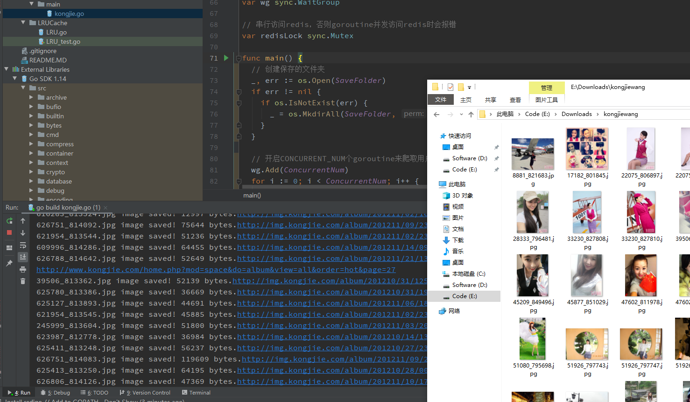

# Kongjie Spider
Concurrent spider using goroutines to crawl images from kongjie.com

# LRU(least recently used) Cache
A thread-safe LRU cache tool implemented by golang.

# BlockChain in Golang

A simple blockchain application implemented in Golang. Anyone can get started with Golang by doing this project, as well as by following the tutorial in reference below.

As the tutorial shows, what you will be able to do with this project:

1. Create your own blockchain
2. Understand how hashing works in maintaining integrity of the blockchain
3. See how new blocks get added
4. See how tiebreakers get resolved when multiple nodes generate blocks
6. View your blockchain in a web browser
7. Write new blocks
8. Get a foundational understanding of the blockchain so you can decide where your journey takes you from here!
9. Run a terminal that provides a genesis block
10. Fire up as many additional terminals as you like and have them write blocks to the first terminal
11. Have the first terminal broadcast updated blocks to the new terminals

# Reference
1. [Code your own blockchain in less than 200 lines of Go](https://medium.com/@mycoralhealth/code-your-own-blockchain-in-less-than-200-lines-of-go-e296282bcffc)
